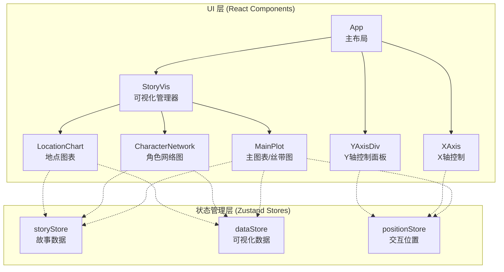
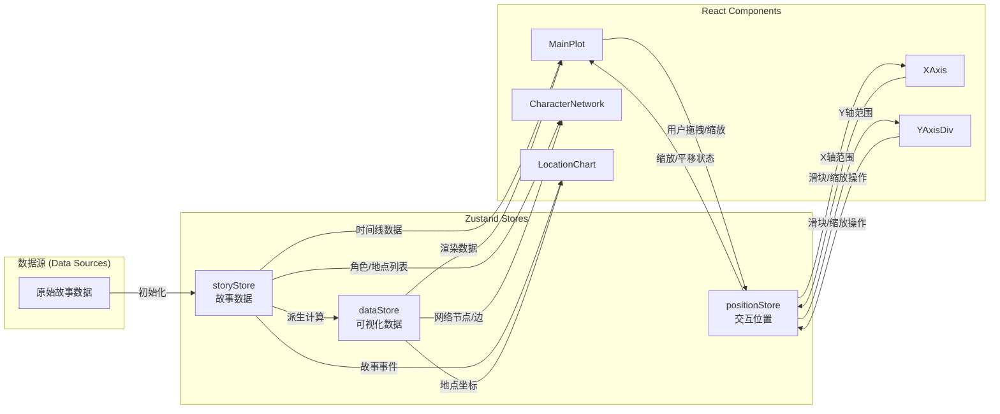
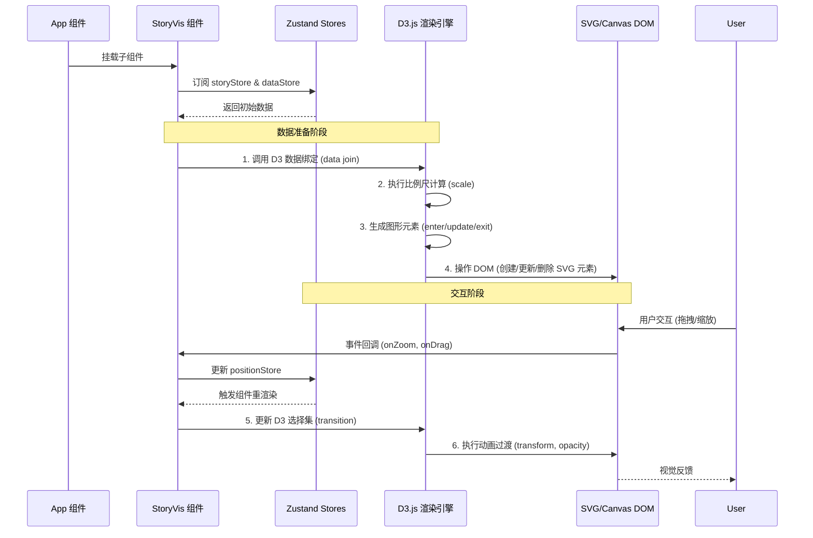
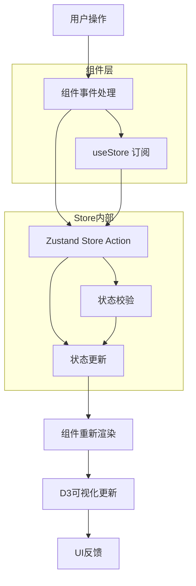

# HumanVIZ 前端架构分析报告 v2

> 📅 生成时间: 2026-05-10 20:14:23
> 🔧 分析工具: DeepSeek API
> 📊 分析文件数: 14 个
> 🆕 新增模块: 可视化修改指南、安全扩展模式、风险检查清单

---

## 📋 目录

**架构分析**
1. [组件关系图](#1-组件关系图)
2. [React 组件树结构](#2-react-组件树结构)
3. [Zustand 状态管理](#3-zustand-状态管理)
4. [D3.js 可视化渲染机制](#4-d3js-可视化渲染机制)
5. [架构总结与开发建议](#5-架构总结与开发建议)

**🆕 可视化修改指南**

6. [修改场景速查表](#6-修改场景速查表)
7. [各场景详细修改方案](#7-各场景详细修改方案)
8. [安全扩展模式与组件模板](#8-安全扩展模式与组件模板)
9. [修改前风险检查清单](#9-修改前风险检查清单)

---

## 1. 组件关系图

好的，作为前端架构分析专家，我将根据您提供的 HumanVIZ 项目组件结构，生成三张 Mermaid 关系图，并附带 TypeScript 代码示例说明数据流和渲染流程。

---

### 1. 组件层级关系图

该图展示了 React 组件的父子嵌套关系，以及它们与 Zustand Store 的关联。



**图例说明：**
- `-->` 表示 React 组件层级关系（父组件包含子组件）。
- `-.->` 表示组件通过 Zustand hooks 订阅对应的 Store。

---

### 2. 数据流关系图

该图展示了数据从 Store 流向组件，以及组件如何通过 Actions 更新 Store 的闭环过程。



**数据流说明：**
1.  **初始化**：`storyStore` 从原始数据加载。
2.  **派生**：`dataStore` 基于 `storyStore` 计算生成可视化所需的特定格式数据（如节点坐标、网络连接）。
3.  **订阅**：各可视化组件（`MainPlot`, `CharacterNetwork`, `LocationChart`）订阅 `storyStore` 和 `dataStore` 以获取渲染数据。
4.  **交互**：`XAxis` 和 `YAxisDiv` 订阅 `positionStore` 以反映当前视图状态，同时用户交互会触发 `positionStore` 的更新。
5.  **反馈**：`positionStore` 更新后，`MainPlot` 等组件重新渲染以反映新的视图状态。

---

### 3. 可视化渲染流程

该图描述了从数据加载到 D3.js 渲染完成的完整生命周期。



**关键流程 TypeScript 示例：**

```typescript
// 1. 在 StoryVis 组件中订阅 Store 并触发 D3 渲染
import { useEffect, useRef } from 'react';
import { useStoryStore, useDataStore, usePositionStore } from './stores';
import * as d3 from 'd3';

const StoryVis: React.FC = () => {
  const svgRef = useRef<SVGSVGElement>(null);
  const storyData = useStoryStore(state => state.storyData);
  const visData = useDataStore(state => state.visData);
  const position = usePositionStore(state => state.position);

  useEffect(() => {
    if (!svgRef.current || !visData) return;

    const svg = d3.select(svgRef.current);
    const g = svg.select('g.chart-group'); // 假设有一个 g 元素作为容器

    // 2. 数据绑定与比例尺计算
    const xScale = d3.scaleLinear()
      .domain(d3.extent(visData, d => d.x) as [number, number])
      .range([0, 800]); // 假设宽度为 800

    const yScale = d3.scaleLinear()
      .domain(d3.extent(visData, d => d.y) as [number, number])
      .range([600, 0]); // 假设高度为 600

    // 3. 执行 D3 的 enter/update/exit 模式
    const circles = g.selectAll('circle')
      .data(visData, (d: any) => d.id); // 使用 key 函数进行稳定绑定

    // exit: 移除多余元素
    circles.exit()
      .transition()
      .duration(500)
      .attr('r', 0)
      .remove();

    // enter: 创建新元素
    const circlesEnter = circles.enter()
      .append('circle')
      .attr('r', 0)
      .attr('cx', d => xScale(d.x))
      .attr('cy', d => yScale(d.y));

    // update: 更新所有元素（包括 enter 和已有元素）
    circlesEnter.merge(circles)
      .transition()
      .duration(1000)
      .attr('cx', d => xScale(d.x))
      .attr('cy', d => yScale(d.y))
      .attr('r', 5)
      .attr('fill', 'steelblue');

    // 4. 处理缩放/平移交互
    const zoom = d3.zoom<SVGSVGElement, unknown>()
      .scaleExtent([0.5, 5])
      .on('zoom', (event) => {
        // 更新 positionStore
        usePositionStore.getState().setPosition(event.transform);
        // 直接操作 DOM 以获得流畅体验
        g.attr('transform', event.transform.toString());
      });

    svg.call(zoom);

    // 5. 清理函数
    return () => {
      svg.on('.zoom', null); // 移除 zoom 事件
    };
  }, [visData]); // 依赖 visData，当数据变化时重新渲染

  return (
    <svg ref={svgRef} width="100%" height="100%">
      <g className="chart-group" />
    </svg>
  );
};
```

**代码注释说明：**
- **数据绑定**：使用 `data(visData, keyFunction)` 确保 D3 能正确追踪每个数据点对应的 DOM 元素，这是高效更新的基础。
- **Enter/Update/Exit**

---

## 2. React 组件树结构

好的，作为前端架构分析专家，我将对 HumanVIZ 项目的 React 组件树结构进行详细分析。

---

## HumanVIZ 项目 React 组件树结构分析

### 1. 组件树结构图

以下是基于提供的代码片段推断出的完整组件嵌套关系树形图。`...` 表示该组件内部还有子组件，但未在提供的代码中完全展开。

```
<MantineProvider>  (main.tsx)
  └── <App>  (App.tsx)
      ├── <Spinner />  (条件渲染)
      ├── <PromptModal />  (条件渲染)
      ├── <AboutModal />  (条件渲染)
      ├── <ClickMsg />  (条件渲染)
      ├── <StoryInfo />  (Header)
      ├── <PlotOptions />  (Header)
      ├── <YAxisDiv />  (Y轴)
      ├── <SceneOptions />  (X轴)
      ├── <StoryVis />  (核心可视化区域)
      │   ├── <svg id="story">
      │   │   ├── <Defs />  (SVG 定义)
      │   │   └── <MainPlot />  (主绘图区域)
      │   │       ├── <XAxis />  (X轴标签)
      │   │       ├── <YAxis />  (Y轴标签)
      │   │       ├── <SceneRect />  (场景矩形)
      │   │       ├── <SceneLines />  (场景连线)
      │   │       ├── <CharacterRect />  (角色矩形)
      │   │       └── ... (其他绘图元素)
      │   └── <XAxisSVG />  (独立的X轴SVG)
      ├── <SceneDiv />  (场景覆盖层)
      ├── <ChapterSidebar />  (章节侧边栏)
      ├── <CharacterDiv />  (角色覆盖层)
      ├── <LocationDiv />  (地点覆盖层)
      ├── <LegendHoverMsg />  (图例悬停提示)
      └── <NetworkHoverMsg />  (网络图悬停提示)
```

### 2. 主要布局组件

项目布局主要由以下几个核心组件构成：

-   **`<App>` (主布局容器)**:
    -   这是整个应用的根组件，负责协调所有子组件的渲染。
    -   它从 `dataStore`、`storyStore`、`positionStore` 等全局状态管理中读取数据，并根据状态（如 `isUpdatingData`、`showLegend`、`detailView`）条件性地渲染不同的 UI 部分。
    -   它本身不直接处理布局的 CSS 细节，而是通过子组件的组合和状态来控制布局。

-   **`<StoryVis>` (核心可视化区域)**:
    -   这是整个应用的核心，负责渲染 D3.js 驱动的 SVG 可视化。
    -   它包含一个 `<svg>` 元素，其尺寸（`width`、`height`、`viewBox`）由 `positionStore` 和 `storyStore` 中的状态动态计算，以实现响应式缩放。
    -   它内部包含 `<Defs>`（用于定义 SVG 滤镜、渐变等）和 `<MainPlot>`（实际绘制图表内容）。

-   **控制面板 (分散在多个组件中)**:
    -   **`<PlotOptions>`**: 位于顶部，提供全局绘图选项（如切换 Y 轴类型、切换视图模式等）。
    -   **`<SceneOptions>`**: 位于 X 轴区域，提供与场景相关的交互选项（如按章节筛选、排序等）。
    -   **`<YAxisDiv>`**: 位于 Y 轴区域，可能包含 Y 轴标签的交互控制。
    -   **`<ChapterSidebar>`**: 位于侧边，提供章节级别的导航和概览。
    -   **`<PromptModal>` / `<AboutModal>`**: 模态框，用于提示用户或展示应用信息。

### 3. 组件职责分工

| 组件名称 | 核心功能 | 所属区域 |
| :--- | :--- | :--- |
| **`App`** | 应用根组件，管理全局状态，协调子组件渲染。 | 根 |
| **`StoryVis`** | 核心可视化容器，管理 SVG 尺寸和滚动，渲染 D3 图表。 | 可视化区域 |
| **`MainPlot`** | 实际绘制 D3 图表（场景、角色、连线等）的组件。 | 可视化区域 |
| **`Defs`** | 定义 SVG 中可复用的元素（如滤镜、渐变、图案）。 | 可视化区域 |
| **`XAxisSVG`** | 渲染独立的 X 轴 SVG，可能与 `MainPlot` 中的 X 轴分离以实现滚动或固定效果。 | 可视化区域 |
| **`XAxis`** | 在 `MainPlot` 内部，渲染 X 轴标签（场景名称、时间等）。 | 可视化区域 |
| **`YAxisDiv`** | 渲染 Y 轴区域，可能包含标签和交互控制。 | Y 轴区域 |
| **`SceneOptions`** | 提供 X 轴相关的交互选项（筛选、排序、缩放等）。 | X 轴区域 |
| **`PlotOptions`** | 提供全局绘图选项（切换 Y 轴类型、视图模式等）。 | 头部 |
| **`StoryInfo`** | 显示当前故事的基本信息（标题、作者等）。 | 头部 |
| **`SceneDiv`** | 场景覆盖层，用于显示场景的详细信息或交互提示。 | 覆盖层 |
| **`ChapterSidebar`** | 章节侧边栏，提供章节导航和概览。 | 侧边栏 |
| **`CharacterDiv`** | 角色覆盖层，用于显示角色的详细信息或交互提示。 | 覆盖层 |
| **`LocationDiv`** | 地点覆盖层，用于显示地点的详细信息或交互提示。 | 覆盖层 |
| **`LegendHoverMsg`** | 图例悬停时显示的提示信息。 | 提示层 |
| **`NetworkHoverMsg`** | 网络图悬停时显示的提示信息。 | 提示层 |
| **`ClickMsg`** | 点击某些元素时显示的提示信息。 | 提示层 |
| **`Spinner`** | 数据加载或更新时显示的加载动画。 | 加载状态 |
| **`PromptModal`** | 提示用户进行某些操作的模态框。 | 模态框 |
| **`AboutModal`** | 显示应用“关于”信息的模态框。 | 模态框 |

### 4. 组件间层级关系

-   **父子关系**:
    -   `<MantineProvider>` 是 `<App>` 的父组件，提供 Mantine UI 主题。
    -   `<App>` 是几乎所有其他组件的父组件，包括 `<StoryVis>`、`<PlotOptions>`、`<YAxisDiv>`、`<SceneOptions>`、`<SceneDiv>`、`<ChapterSidebar>` 等。
    -   `<StoryVis>` 是 `<MainPlot>`、`<Defs>` 和 `<XAxisSVG>` 的父组件。
    -   `<MainPlot>` 是 `<XAxis>`、`<YAxis>`、`<SceneRect>`、`<SceneLines>`、`<CharacterRect>` 等绘图元素的父组件。

-   **兄弟关系**:
    -   `<PlotOptions>` 和 `<StoryInfo>` 是兄弟组件，都位于头部区域。
    -   `<StoryVis>`、`<YAxisDiv>`、`<SceneOptions>` 是兄弟组件，共同构成主布局区域。
    -   `<SceneDiv>`、`<ChapterSidebar>`、`<CharacterDiv>`、`<LocationDiv>` 是兄弟组件，都属于覆盖层/侧边栏区域。
    -   `<LegendHoverMsg>`、`<NetworkHoverMsg>`、`<ClickMsg>` 是兄弟组件，都属于提示层区域。

### 5. 关键 Props 传递

该项目大量使用了 **Zustand** 状态管理库（`dataStore`、`storyStore`、`positionStore`），因此组件间的数据传递主要通过 **全局状态** 进行，而非传统的 Props 逐层传递。这使得组件树扁平化，减少了 Props Drilling 问题。

**通过 Props 传递的关键数据（基于代码片段推断）**:

-   **`<StoryVis>` -> `<MainPlot>`**:
    -   `plotWidth`, `plotHeight`, `scenePos` (来自 `positionStore`)
    -   `locations`, `scene_data` (来自 `dataStore`)
    -   `fullHeight`, `yAxis`, `detailView` (来自 `storyStore`)
    -   **传递方式**: 这些状态在 `StoryVis` 中通过 Zustand hooks 获取，然后作为 Props 传递给 `<MainPlot>`。`MainPlot` 再将这些 Props 传递给其内部的绘图子组件。

    ```typescript
    // 在 StoryVis.tsx 中
    function StoryVis() {
      const { plotWidth, plotHeight, scenePos }

---

## 3. Zustand 状态管理

# HumanVIZ Zustand 状态管理架构分析

## 1. 状态切片设计

### 1.1 状态字段分类

```typescript
// 状态切片分类
interface IStore {
  // ===== 核心配置状态 =====
  demoMode: boolean;          // 演示模式开关
  story: string;              // 当前故事ID
  chapterView: boolean;       // 章节视图开关
  themeView: boolean;         // 主题视图开关
  fullHeight: boolean;        // 全高度模式
  scaleByLength: boolean;     // 按长度缩放

  // ===== 布局尺寸状态 =====
  storyMarginTop: number;     // 故事上边距
  yAxisHeight: number;        // Y轴高度
  xAxisWidth: number;         // X轴宽度
  storyScroll: number;        // 故事垂直滚动位置
  storyScrollX: number;       // 故事水平滚动位置

  // ===== 可视化配置状态 =====
  showOverlay: boolean;       // 覆盖层显示
  colorBy: string;            // 颜色映射字段
  sizeBy: string;             // 大小映射字段
  weightBy: string;           // 权重映射字段
  characterColor: string;     // 角色颜色方案
  showChapters: boolean;      // 显示章节标记

  // ===== 交互悬停状态 =====
  locationHover: string;      // 地点悬停
  characterHover: string;     // 角色悬停
  groupHover: string;         // 分组悬停
  customHover: string;        // 自定义悬停
  linkHover: string[];        // 链接悬停（数组）
  sceneHover: string;         // 场景悬停
  chapterHover: string;       // 章节悬停
  legendHover: string;        // 图例悬停
  networkHover: string;       // 网络悬停

  // ===== UI 控制状态 =====
  hidden: string[];           // 隐藏元素列表
  minimized: string[];        // 最小化元素列表
  showLegend: boolean;        // 显示图例
  sidebarOpen: boolean;       // 侧边栏开关
  detailView: boolean;        // 详情视图

  // ===== 阅读模式状态 =====
  showChapterText: boolean;   // 显示章节文本
  curScrollScene: string;     // 当前滚动场景
  scrollSource: boolean;      // 滚动来源标记
  cumulativeMode: boolean;    // 累积模式
  verboseMode: boolean;       // 详细模式

  // ===== 模态框状态 =====
  modalOpened: boolean;       // 模态框打开
  aboutModalOpened: boolean;  // 关于模态框
  modalLoading: boolean;      // 模态框加载
  modalType: string;          // 模态框类型

  // ===== 后端状态 =====
  isBackendActive: boolean;   // 后端活跃状态
  isUpdatingData: boolean;    // 数据更新中

  // ===== 重置方法 =====
  resetAll: () => void;       // 重置所有状态
}
```

### 1.2 状态切片设计模式

```typescript
// 使用单一Store而非多个切片的设计
// 优点：简化状态同步，避免跨Store通信
// 缺点：状态耦合度高，不利于代码分割

// 状态初始化策略
const initialState = {
  // 演示模式使用默认值，开发模式使用分析值
  colorBy: DEMO_MODE ? "default" : "sentiment",
  sizeBy: DEMO_MODE ? "default" : "importance",
  weightBy: DEMO_MODE ? "default" : "conflict",
  verboseMode: DEMO_MODE ? false : true,
  // ... 其他初始值
};
```

## 2. 数据流向

### 2.1 完整数据流路径



### 2.2 典型数据流示例

```typescript
// 示例：用户切换章节视图
// 1. 用户点击按钮
// 2. 组件调用 setChapterView
// 3. Store更新状态
// 4. 订阅该状态的组件重新渲染
// 5. D3可视化根据新状态更新

// 组件中的使用
const ChapterToggle: React.FC = () => {
  // 订阅状态
  const chapterView = useStoryStore(state => state.chapterView);
  const setChapterView = useStoryStore(state => state.setChapterView);
  
  return (
    <button onClick={() => setChapterView(!chapterView)}>
      {chapterView ? '隐藏章节' : '显示章节'}
    </button>
  );
};
```

## 3. Actions 分析

### 3.1 主要Action函数

```typescript
// Action 分类与触发时机

// ===== 核心配置Actions =====
setStory(val: string)          // 切换故事时触发
setChapterView(val: boolean)   // 章节视图切换
setThemeView(val: boolean)     // 主题视图切换
setFullHeight(val: boolean)    // 全高度模式切换
setScaleByLength(val: boolean) // 缩放模式切换

// ===== 布局Actions =====
setStoryMarginTop(val: number) // 窗口resize时触发
setYAxisHeight(val: number)    // 图表resize时触发
setXAxisWidth(val: number)     // 图表resize时触发
setStoryScroll(val: number)    // 滚动事件触发
setStoryScrollX(val: number)   // 水平滚动触发

// ===== 可视化配置Actions =====
setColorBy(val: string)        // 颜色映射切换
setSizeBy(val: string)         // 大小映射切换
setWeightBy(val: string)       // 权重映射切换
setCharacterColor(val: string) // 角色颜色方案切换

// ===== 交互Actions =====
setLocationHover(val: string)  // 鼠标悬停地点
setCharacterHover(val: string) // 鼠标悬停角色
setLinkHover(val: string[])    // 鼠标悬停链接
setHidden(val: string[])       // 隐藏元素操作
setMinimized(val: string[])    // 最小化元素操作

// ===== 模态框Actions =====
setModalOpened(val: boolean)   // 打开/关闭模态框
setModalType(val: string)      // 切换模态框类型

// ===== 后端Actions =====
setIsBackendActive(val: boolean)  // 后端连接状态变化
setIsUpdatingData(val: boolean)   // 数据更新状态变化

// ===== 重置Action =====
resetAll()  // 重置所有状态到初始值
```

### 3.2 Action触发时序

```typescript
// 典型操作序列：用户打开详情视图
// 1. 用户点击详情按钮
// 2. setDetailView(true)
// 3. 组件重新渲染
// 4. 可能触发其他副作用

// 复杂操作：切换故事
// 1. setStory("new-story")
// 2. 触发数据加载
// 3. setIsUpdatingData(true)
// 4. 数据加载完成
// 5. setIsUpdatingData(false)
// 6. 重置相关状态
```

## 4. Store间依赖关系

### 4.1 当前架构特点

```typescript
// 当前使用单一Store，没有Store间依赖
// 但存在状态间的隐式依赖关系

// 隐式依赖示例
interface IStore {
  // 悬停状态与隐藏状态的关系
  locationHover: string;      // 悬停时影响
  hidden: string[];           // 隐藏状态影响悬停效果
  
  // 视图模式与滚动状态的关系
  chapterView: boolean;       // 影响滚动行为
  storyScroll: number;        // 滚动位置依赖视图模式
  
  // 模态框状态关系
  modalOpened: boolean;       // 依赖
  modalLoading: boolean;      // 模态框加载状态
  modalType: string;          // 模态框类型
}
```

### 4.2 状态依赖图

```mermaid
graph LR
    A[视图模式] --> B[滚动状态]
    A --> C[布局尺寸]
    B --> D[

---

## 4. D3.js 可视化渲染机制

# HumanVIZ D3.js 可视化实现机制深度分析

## 1. 数据绑定流程

### 1.1 数据获取与状态管理

HumanVIZ 使用 Zustand 状态管理库，通过三个 Store 管理数据流：

```typescript
// stores/dataStore.ts - 数据存储
interface DataStore {
  locations: LocationData[];
  scene_data: SceneData[];
  character_data: CharacterData[];
  // ... 其他数据
}

// stores/storyStore.ts - 可视化状态
interface StoryStore {
  yAxis: 'location' | 'character';
  detailView: boolean;
  fullHeight: boolean;
  // ... 交互状态
}

// stores/positionStore.ts - 位置计算
interface PositionStore {
  plotWidth: number;
  plotHeight: number;
  scenePos: Map<string, {x: number, y: number}>;
}
```

### 1.2 D3 数据绑定实现

在 `MainPlot` 组件中，数据通过 React 的 `useMemo` 和 `useEffect` 进行预处理：

```typescript
// MainPlot.tsx - 数据绑定核心逻辑
function MainPlot() {
  // 1. 从 Store 获取数据
  const { sceneBoxes, characterPaths } = useMemo(() => {
    // 预处理场景位置数据
    return computeScenePositions(scene_data, locations, yAxis);
  }, [scene_data, locations, yAxis]);

  // 2. 使用 D3 进行数据绑定
  useEffect(() => {
    const svg = d3.select("#main-plot");
    
    // 绑定场景数据
    const scenes = svg.selectAll(".scene")
      .data(sceneBoxes, (d: SceneBox) => d.id);
    
    // 进入选择集
    scenes.enter()
      .append("g")
      .attr("class", "scene")
      .attr("transform", d => `translate(${d.x}, ${d.y})`);
    
    // 更新选择集
    scenes.attr("transform", d => `translate(${d.x}, ${d.y})`);
    
    // 退出选择集
    scenes.exit().remove();
  }, [sceneBoxes]);
}
```

### 1.3 数据预处理管道

```typescript
// utils/helpers.ts - 数据预处理函数
export const computeScenePositions = (
  scenes: SceneData[],
  locations: LocationData[],
  yAxis: 'location' | 'character'
): SceneBox[] => {
  return scenes.map((scene, index) => {
    const yPosition = yAxis === 'location' 
      ? getLocationY(scene.location, locations)
      : getCharacterY(scene.characters);
    
    return {
      id: scene.id,
      x: index * scene_width,  // 时间轴位置
      y: yPosition,
      width: scene_width,
      height: scene_height,
      data: scene
    };
  });
};
```

## 2. 比例尺设定

### 2.1 时间比例尺

```typescript
// 时间轴比例尺
const timeScale = d3.scaleLinear()
  .domain([0, scene_data.length - 1])  // 场景索引范围
  .range([0, plotWidth]);              // 画布宽度

// 动态调整
useEffect(() => {
  timeScale.range([0, plotWidth]);
  // 重新绘制
}, [plotWidth]);
```

### 2.2 位置比例尺

```typescript
// 位置比例尺（用于 Y 轴）
const locationScale = d3.scalePoint()
  .domain(locations.map(l => l.name))
  .range([margin.top, plotHeight - margin.bottom])
  .padding(0.5);

// 字符比例尺
const characterScale = d3.scaleBand()
  .domain(characters.map(c => c.name))
  .range([margin.top, plotHeight - margin.bottom])
  .padding(0.2);
```

### 2.3 动态调整策略

```typescript
// 根据视图模式调整比例尺
const getYScale = (yAxis: 'location' | 'character') => {
  if (yAxis === 'location') {
    return d3.scalePoint()
      .domain(locations.map(l => l.name))
      .range([0, plotHeight])
      .padding(0.5);
  } else {
    return d3.scaleBand()
      .domain(characters.map(c => c.name))
      .range([0, plotHeight])
      .padding(0.2);
  }
};

// 响应式更新
useEffect(() => {
  const yScale = getYScale(yAxis);
  // 更新所有 Y 位置
  updatePositions(yScale);
}, [yAxis, plotHeight]);
```

## 3. 颜色映射

### 3.1 Chroma.js 色阶方案

```typescript
// utils/colors.ts - 颜色映射系统
import chroma from 'chroma-js';

// 预定义色阶
const colors1 = chroma.scale("YlOrRd").padding([0.25, 0.1]).colors(7).reverse();
const colors2 = chroma.scale("YlGn").padding([0.35, 0.55]).colors(2);
const colors3 = chroma.scale("YlGnBu").padding([0.35, 0.1]).colors(7);
const colors4 = chroma.scale("RdPu").padding([0.3, 0.1]).colors(7).reverse();

// 合并色阶
const allColors = chroma.scale(
  colors1.concat(colors2).concat(colors3).concat(colors4)
);

// 情感颜色映射
export const emotionColor = chroma.scale("RdBu")
  .padding([0.2, 0.2])
  .domain([-1, 1]);  // 情感值范围 -1 到 1

// 重要性颜色映射
export const importanceColor = chroma.scale("Blues")
  .domain([0, 1]);  // 重要性范围 0 到 1
```

### 3.2 颜色选择器

```typescript
// 根据属性选择颜色
export const getColor = (
  character: CharacterData,
  colorBy: string,
  customColors?: CustomColorDict
): string => {
  switch (colorBy) {
    case 'sentiment':
      return emotionColor(character.sentiment);
    case 'importance':
      return importanceColor(character.importance);
    case 'group':
      return getGroupColor(character.group);
    case 'llm':
      return getLLMColor(character.llm);
    case 'custom':
      return getCustomColor(character, customColors);
    default:
      return '#666';  // 默认灰色
  }
};
```

### 3.3 图例生成

```typescript
// 图例组件
function ColorLegend({ colorBy, scale }: ColorLegendProps) {
  const svgRef = useRef<SVGSVGElement>(null);

  useEffect(() => {
    const svg = d3.select(svgRef.current);
    
    if (colorBy === 'sentiment') {
      // 连续色阶图例
      const gradient = svg.append("defs")
        .append("linearGradient")
        .attr("id", "sentiment-gradient");
      
      gradient.selectAll("stop")
        .data(emotionColor.colors(10))
        .enter()
        .append("stop")
        .attr("offset", (d, i) => `${i * 10}%`)
        .attr("stop-color", d => d);
      
      svg.append("rect")
        .attr("width", 200)
        .attr("height", 20)
        .style("fill", "url(#sentiment-gradient)");
    } else {
      // 离散色阶图例
      const legend = svg.selectAll(".legend-item")
        .data(scale.domain())
        .enter()
        .append("g")
        .attr("class", "legend-item");
      
      legend.append("rect")
        .attr("width", 10)
        .attr("height", 10)
        .style("fill", d => scale(d));
    }
  }, [colorBy, scale]);

  return <svg ref={svgRef} />;
}
```

## 4. 丝带路径生成

### 4.1 路径生成器类型

```typescript
// 使用 D3 的曲线生成器
const ribbonGenerator = d3.line<Point>()
  .x(d => d.x)
  .y(d => d.y)
  .curve(d3.curveCatmullRom);  // Catmull-Rom 曲线，平滑连接

// 或者使用贝塞尔曲线
const bezierGenerator = d3.line<Point>()
  .x(d => d.x)
  .y(d => d.y)
  .curve(d3.curveBasis);  // B 样条曲线
```

### 4.2 坐标计算逻辑

```typescript
// 丝带路径计算
const computeR

---

## 5. 架构总结与开发建议

# HumanVIZ 前端架构全面分析

## 1. 架构优势

### 1.1 关注点分离
```typescript
// stores/storyStore.ts - 故事数据管理
interface StoryStore {
  characters: Character[];
  locations: Location[];
  timeline: TimelineEvent[];
  // 纯数据操作，不涉及渲染逻辑
  addCharacter: (character: Character) => void;
  updateTimeline: (events: TimelineEvent[]) => void;
}

// stores/dataStore.ts - 数据处理与转换
interface DataStore {
  processedData: ProcessedData | null;
  // 数据清洗、聚合、过滤逻辑
  processRawData: (raw: RawData) => void;
  filterByTimeRange: (start: Date, end: Date) => void;
}

// stores/positionStore.ts - 可视化位置管理
interface PositionStore {
  nodePositions: Map<string, { x: number; y: number }>;
  // 布局算法和位置计算
  updateForceLayout: () => void;
  setZoom: (scale: number) => void;
}
```

### 1.2 状态管理分层
- **数据层** (storyStore)：原始数据存储
- **计算层** (dataStore)：数据转换与聚合
- **展示层** (positionStore)：可视化位置与交互状态

### 1.3 组件树清晰
```
App
├── StoryVis (故事总览)
│   ├── MainPlot (主线图)
│   │   ├── XAxis
│   │   └── YAxisDiv
│   ├── CharacterNetwork (角色网络)
│   └── LocationChart (地点图表)
```

## 2. 技术栈整合

### 2.1 React + Zustand 状态管理
```typescript
// 使用 Zustand 的 selector 优化渲染
const CharacterNetwork = () => {
  // 只订阅需要的状态片段
  const characters = useStoryStore(state => state.characters);
  const positions = usePositionStore(state => state.nodePositions);
  
  // 避免不必要的重渲染
  const filteredCharacters = useMemo(() => 
    characters.filter(c => positions.has(c.id)),
    [characters, positions]
  );
  
  return <NetworkGraph data={filteredCharacters} />;
};
```

### 2.2 D3.js 集成模式
```typescript
// 使用 ref 管理 D3 生命周期
const MainPlot: React.FC<MainPlotProps> = ({ data }) => {
  const svgRef = useRef<SVGSVGElement>(null);
  const containerRef = useRef<HTMLDivElement>(null);
  
  // D3 渲染逻辑封装
  useEffect(() => {
    if (!svgRef.current) return;
    
    const svg = d3.select(svgRef.current);
    const { width, height } = containerRef.current!.getBoundingClientRect();
    
    // 创建缩放行为
    const zoom = d3.zoom<SVGSVGElement, unknown>()
      .scaleExtent([0.5, 5])
      .on('zoom', (event) => {
        svg.select('.plot-group')
          .attr('transform', event.transform);
      });
    
    svg.call(zoom);
    
    // 清理函数
    return () => {
      svg.selectAll('*').remove();
    };
  }, [data]);
  
  return (
    <div ref={containerRef} style={{ width: '100%', height: '100%' }}>
      <svg ref={svgRef}>
        <g className="plot-group" />
      </svg>
    </div>
  );
};
```

### 2.3 TypeScript 类型安全
```typescript
// 统一的类型定义
interface Character {
  id: string;
  name: string;
  traits: CharacterTrait[];
  relationships: Relationship[];
  timeline: CharacterTimeline[];
}

interface CharacterTrait {
  type: 'personality' | 'appearance' | 'background';
  value: string;
  confidence: number;
}

// 类型守卫确保数据完整性
function isValidCharacter(data: unknown): data is Character {
  return (
    typeof data === 'object' &&
    data !== null &&
    'id' in data &&
    'name' in data &&
    'traits' in data &&
    'relationships' in data
  );
}
```

### 2.4 Chroma.js 颜色管理
```typescript
// colors.ts - 统一的颜色方案
import chroma from 'chroma-js';

const colorScale = chroma.scale(['#4e79a7', '#f28e2b', '#e15759', '#76b7b2'])
  .mode('lch')
  .correctLightness(true);

export function getCharacterColor(characterId: string): string {
  // 基于 ID 生成稳定颜色
  const hash = hashCode(characterId);
  return colorScale(hash % 100 / 100).hex();
}

export function getRelationshipColor(strength: number): string {
  // 关系强度映射到颜色
  return chroma.mix('#4e79a7', '#e15759', strength, 'lab').hex();
}
```

## 3. 可扩展性

### 3.1 数据源扩展
```typescript
// 支持多种数据格式
interface DataAdapter<T> {
  parse(rawData: T): ProcessedData;
  validate(data: unknown): data is T;
}

// 实现具体适配器
class JSONAdapter implements DataAdapter<JSONData> {
  parse(rawData: JSONData): ProcessedData {
    // JSON 格式解析
  }
  validate(data: unknown): data is JSONData {
    return typeof data === 'object' && data !== null;
  }
}

class CSVAdapter implements DataAdapter<CSVData> {
  parse(rawData: CSVData): ProcessedData {
    // CSV 格式解析
  }
  validate(data: unknown): data is CSVData {
    return Array.isArray(data) && data.length > 0;
  }
}
```

### 3.2 可视化类型扩展
```typescript
// 可插拔的可视化组件
interface VisualizationPlugin {
  type: string;
  component: React.ComponentType<VisualizationProps>;
  config: VisualizationConfig;
}

const visualizationRegistry = new Map<string, VisualizationPlugin>();

export function registerVisualization(plugin: VisualizationPlugin) {
  visualizationRegistry.set(plugin.type, plugin);
}

// 动态渲染
const DynamicVisualization: React.FC<{ type: string; data: any }> = ({ type, data }) => {
  const plugin = visualizationRegistry.get(type);
  if (!plugin) return <div>Unknown visualization type</div>;
  
  const Component = plugin.component;
  return <Component data={data} config={plugin.config} />;
};
```

### 3.3 交互模式扩展
```typescript
// 可组合的交互行为
interface InteractionHandler {
  type: 'hover' | 'click' | 'drag' | 'zoom';
  handler: (event: InteractionEvent) => void;
  priority: number;
}

// 使用组合模式管理交互
class InteractionManager {
  private handlers: InteractionHandler[] = [];
  
  addHandler(handler: InteractionHandler) {
    this.handlers.push(handler);
    this.handlers.sort((a, b) => b.priority - a.priority);
  }
  
  handleEvent(event: InteractionEvent) {
    for (const handler of this.handlers) {
      if (handler.type === event.type) {
        handler.handler(event);
      }
    }
  }
}
```

## 4. 组件复用性

### 4.1 可直接复用的组件

**坐标轴组件**
```typescript
// XAxis.tsx - 通用时间轴
interface XAxisProps {
  scale: d3.ScaleTime<number, number>;
  tickFormat?: (date: Date) => string;
  orientation?: 'top' | 'bottom';
  height?: number;
}

// YAxisDiv.tsx - 通用数值轴
interface YAxisProps {
  scale: d3.ScaleLinear<number, number>;
  tickCount?: number;
  label?: string;
  gridLines?: boolean;
}
```

**颜色工具**
```typescript
// colors.ts 中的工具函数
export {
  getCharacterColor,    // 角色颜色
  getRelationshipColor, // 关系颜色
  getLocationColor,     // 地点颜色
  getTimelineColor,     // 时间线颜色
  colorScale,           // 通用色阶
}
```

### 4.2 可复用的自定义 Hooks
```typescript
// hooks/useD3Zoom.ts
function useD3Zoom(svgRef: RefObject<SVGSVGElement>, options?: ZoomOptions) {
  // 通用缩放逻辑
}

// hooks/useResizeObserver.ts
function useResizeObserver(ref: RefObject<HTMLElement>) {
  // 响应式尺寸监听
}

// hooks/useAnimationFrame.ts
function useAnimationFrame(callback: (deltaTime: number) => void, active: boolean) {
  // 动画帧管理
}
```

## 5. 性能考虑

### 5.1 

---

## 6. 修改场景速查表

> 根据你想改的内容，快速定位需要改动的文件和风险等级。

| 想改什么 | 主要改动文件 | 风险 | 核心策略 |
|---------|------------|------|---------|
| 修改颜色/配色方案 | `utils/colors.ts` | 🟢 低 | 只改 colors.ts，组件通过函数引用颜色，不需要改组件本体 |
| 修改丝带路径/形状 | `components/Vis/MainPlot.tsx` | 🟡 中 | 只改 MainPlot.tsx 中的 D3 路径生成器参数，不动数据绑定逻辑 |
| 修改角色网络图布局 | `components/Vis/CharacterNetwork.tsx` | 🟡 中 | 修改 D3 force simulation 参数，保持节点数据结构不变 |
| 修改坐标轴样式 | `components/XAxis/XAxis.tsx`<br>`components/YAxis/YAxisDiv.tsx` | 🟢 低 | 这两个组件相对独立，修改不影响数据逻辑 |
| 新增一种可视化图表 | `components/Vis/StoryVis.tsx` | 🔴 高 | 新建独立组件文件，在 StoryVis.tsx 中条件渲染，不改现有组件 |
| 修改动画/过渡效果 | `components/Vis/MainPlot.tsx`<br>`components/Vis/CharacterNetwork.tsx` | 🟢 低 | 只改 D3 transition().duration() 参数，或 CSS transition 属性 |
| 修改数据处理/过滤逻辑 | `stores/dataStore.ts` | 🔴 高 | dataStore 被多个组件订阅，改动会全局影响，必须先理清订阅关系 |
| 修改布局/尺寸 | `App.tsx` | 🟡 中 | App.tsx 控制整体布局，修改 flex/grid 属性；各子组件尺寸通过 props 传入 |

---

## 7. 各场景详细修改方案

> 以下内容结合真实项目代码，给出每种改动的具体操作步骤。

好的，作为资深前端架构师，我将针对 HumanVIZ 项目的 8 个预定义修改场景，结合提供的真实代码，生成详细的修改指南。

---

### 🟢 修改颜色/配色方案

1.  **要改哪个文件**
    -   **主要文件**: `utils/colors.ts`
    -   **次要文件**: 通常不需要改动，但如果需要新增颜色映射函数，可能会涉及 `components/Vis/MainPlot.tsx`。

2.  **要改哪个函数/代码块**
    -   **目标**: 修改 `colors.ts` 中定义的色阶（scale）或颜色数组。
    -   **具体定位**:
        -   `const colors1 = chroma.scale("YlOrRd").padding([0.25, 0.1]).colors(7).reverse();` (第 20 行附近)
        -   `export const emotionColor = chroma.scale(blues.concat("#ddd").concat(reds)).domain([-1, 1]);` (第 30 行附近)
        -   `export const importanceColor = chroma.scale("Purples").padding([0.25, 0]);` (第 36 行附近)

3.  **修改前后的代码对比示例**

    **修改前 (默认配色)**:
    ```typescript
    // utils/colors.ts
    import chroma from "chroma-js";

    const colors1 = chroma.scale("YlOrRd").padding([0.25, 0.1]).colors(7).reverse();
    const colors2 = chroma.scale("YlGn").padding([0.35, 0.55]).colors(2);
    const colors3 = chroma.scale("YlGnBu").padding([0.35, 0.1]).colors(7);
    const colors4 = chroma.scale("RdPu").padding([0.3, 0.1]).colors(7).reverse();
    ```

    **修改后 (替换为更现代的配色方案)**:
    ```typescript
    // utils/colors.ts
    import chroma from "chroma-js";

    // ✅ 安全操作：替换色阶定义，使用更柔和的配色
    const colors1 = chroma.scale(["#f7fbff", "#08306b"]).colors(7); // 使用蓝色系
    const colors2 = chroma.scale(["#f0f9e8", "#0868ac"]).colors(2); // 蓝绿系
    const colors3 = chroma.scale(["#fff7ec", "#7f2704"]).colors(7); // 橙色系
    const colors4 = chroma.scale(["#fcfbfd", "#3f007d"]).colors(7); // 紫色系
    ```

4.  **哪些地方绝对不能动**
    -   ⚠️ **不能修改颜色函数的导出名称和签名**。例如，`export const emotionColor = ...` 这个变量名和它的类型 `chroma.Scale` 不能改变，否则所有引用它的组件（如 `MainPlot.tsx`）都会报错。
    -   ⚠️ **不能修改 `domain` 参数**。例如 `emotionColor` 的 `domain([-1, 1])` 是固定的，它决定了数据值如何映射到颜色上。修改它会破坏情感值的色彩映射逻辑。

5.  **修改完如何验证**
    -   **视觉检查**: 运行项目，观察 `MainPlot` 中的丝带、`CharacterNetwork` 中的节点颜色是否已更新为你设定的新配色。
    -   **边界测试**: 检查数据中极端值（如情感值 -1 和 1）的颜色是否正确映射到色阶的两端。

---

### 🟡 修改丝带路径/形状

1.  **要改哪个文件**
    -   **主要文件**: `components/Vis/MainPlot.tsx`
    -   **次要文件**: `utils/helpers.ts` (如果涉及路径生成辅助函数)

2.  **要改哪个函数/代码块**
    -   **目标**: 修改 D3 路径生成器的 `curve` 类型或插值参数。
    -   **具体定位**: 在 `MainPlot.tsx` 中搜索 `d3.line()`、`d3.area()` 或 `d3.ribbon()` 等路径生成器。通常会在渲染丝带的 `useEffect` 或 `useMemo` 中。

3.  **修改前后的代码对比示例**

    **修改前 (默认曲线)**:
    ```typescript
    // components/Vis/MainPlot.tsx (假设代码)
    import * as d3 from "d3";

    const lineGenerator = d3.line()
      .x(d => xScale(d.x))
      .y(d => yScale(d.y))
      .curve(d3.curveMonotoneX); // 使用单调曲线
    ```

    **修改后 (使用更平滑的曲线)**:
    ```typescript
    // components/Vis/MainPlot.tsx
    import * as d3 from "d3";

    const lineGenerator = d3.line()
      .x(d => xScale(d.x))
      .y(d => yScale(d.y))
      // ✅ 安全操作：仅修改 curve 类型，不改变数据绑定逻辑
      .curve(d3.curveCatmullRom.alpha(0.5)); // 使用 Catmull-Rom 曲线，alpha 控制张力
    ```

4.  **哪些地方绝对不能动**
    -   ⚠️ **不能修改 `.x()` 和 `.y()` 访问器函数**。这些函数定义了如何从数据对象中提取坐标，是数据绑定的核心。修改它们会导致路径完全错位。
    -   ⚠️ **不能修改生成路径的 `data` 数组**。不要改变传递给 `lineGenerator(data)` 的 `data` 变量的来源或结构。

5.  **修改完如何验证**
    -   **视觉检查**: 运行项目，观察丝带的弯曲程度和形状是否改变。例如，从尖锐的折线变为平滑的曲线。
    -   **交互测试**: 确保鼠标悬停、点击等交互事件仍然能正确触发，且高亮区域与新的路径形状匹配。

---

### 🟡 修改角色网络图布局

1.  **要改哪个文件**
    -   **主要文件**: `components/Vis/CharacterNetwork.tsx`

2.  **要改哪个函数/代码块**
    -   **目标**: 修改 D3 force simulation 的参数。
    -   **具体定位**: 搜索 `d3.forceSimulation()`、`forceLink`、`forceManyBody`、`forceCenter` 等关键字。

3.  **修改前后的代码对比示例**

    **修改前 (默认布局)**:
    ```typescript
    // components/Vis/CharacterNetwork.tsx (假设代码)
    import * as d3 from "d3";

    const simulation = d3.forceSimulation(nodes)
      .force("link", d3.forceLink(links).id(d => d.id).distance(100))
      .force("charge", d3.forceManyBody().strength(-300))
      .force("center", d3.forceCenter(width / 2, height / 2));
    ```

    **修改后 (更紧凑的布局)**:
    ```typescript
    // components/Vis/CharacterNetwork.tsx
    import * as d3 from "d3";

    const simulation = d3.forceSimulation(nodes)
      .force("link", d3.forceLink(links).id(d => d.id)
        // ✅ 安全操作：调整连线距离，使节点更靠近
        .distance(50))
      .force("charge", d3.forceManyBody()
        // ✅ 安全操作：减小排斥力，使节点更紧凑
        .strength(-100))
      .force("center", d3.forceCenter(width / 2, height / 2));
    ```

4.  **哪些地方绝对不能动**
    -   ⚠️ **不能修改 `nodes` 和 `links` 的数据结构**。例如，不能改变 `nodes` 数组中每个对象的 `id` 属性名，或 `links` 数组中 `source` 和 `target` 的引用方式。
    -   ⚠️ **不能修改 `simulation.on("tick", ...)` 回调函数**。这个函数负责在每次模拟迭代后更新 DOM 元素的位置，修改它会导致节点无法正确渲染。

5.  **修改完如何验证**
    -   **视觉检查**: 运行项目，观察角色网络图中节点之间的距离和整体布局是否变得更紧凑或更松散。
    -   **交互测试**: 拖拽节点，观察其弹性效果是否与新的力参数匹配。

---

### 🟢 修改坐标轴样式

1.  **要改哪个文件**
    -   **主要文件**: `components/XAxis/XAxis.tsx` 和 `components/YAxis/YAxisDiv.tsx`

2.  **要改哪个函数/代码块**
    -   **目标**: 修改 D3 轴生成器的 `tickFormat`、`tickSize` 或 CSS 样式。
    -   **具体定位**: 搜索 `d3.axisBottom()`、`d3.axisLeft()`、`tickFormat`、`tickSize` 等关键字。

3.  **修改前后的代码对比示例**

    **修改前 (默认样式)**:
    ```typescript
    // components/XAxis/XAxis.tsx (假设代码)
    import * as d3 from "d3";

    const xAxis = d3.axisBottom(xScale)
      .tickSize(6)
      .tickFormat(d3.format("d")); // 数字格式
    ```

    **修改后 (自定义样式)**:
    ```typescript
    // components/XAxis/XAxis.tsx
    import * as d3 from "d3";

    const xAxis = d3.axisBottom(xScale)
      // ✅ 安全操作：修改刻度线长度
      .tickSize(10)
      // ✅ 安全操作：修改刻度标签格式，例如显示为百分比
      .tickFormat(d => `${d}%`);
    ```

4.  **哪些地方绝对不能动**
    -   ⚠️ **不能修改传递给轴生成器的 `xScale` 或 `yScale`**。这些比例尺是数据空间和像素空间映射的核心，修改它们会导致整个坐标轴刻度错乱。
    -   ⚠️ **不能修改轴组件的 `ref` 或挂载逻辑**。例如，`XAxisSVG` 组件在 `StoryVis.tsx` 中的渲染位置和方式不能改变。

5.  **修改完如何验证**
    -   **视觉检查**: 运行项目，观察 X 轴和 Y 轴的刻度标签格式、刻度线长度是否已更新。
    -   **数据对齐测试**: 检查图表中的数据点是否仍然与新的坐标轴刻度对齐。

---

### 🔴 新增一种可视化图表

1.  **要改哪个文件**
    -   **主要文件**: `components/Vis/StoryVis.tsx`
    -   **次要文件**: `stores/dataStore.ts` 和 `stores/storyStore.ts`

2.  **要改哪个函数/代码块**
    -   **目标**: 在 `StoryVis.tsx` 中条件渲染新组件。
    -   **具体定位**: `StoryVis.tsx` 的 `return` 语句块。

3.  **修改前后的代码对比示例**

    **修改前 (仅渲染现有图表)**:
    ```typescript
    // components/Vis/StoryVis.tsx
    function StoryVis() {
      // ... 现有逻辑
      return (
        <div>
          <svg ...>
            <Defs />
            <MainPlot />
          </svg>
          <XAxisSVG />
        </div>
      );
    }
    ```

    **修改后 (新增条件渲染)**:
    ```typescript
    // components/Vis/StoryVis.tsx
    import MyNewChart from "./MyNewChart"; // 新建组件
    import { storyStore } from "../../stores/storyStore";

    function StoryVis() {
      // ✅ 安全操作：从 store 中获取控制新图表显示的状态
      const { showNewChart } = storyStore();

      return (
        <div>
          <svg ...>
            <Defs />
            <MainPlot />
          </svg>
          <XAxisSVG />
          {/* ✅ 安全操作：条件渲染新组件，不影响现有组件 */}
          {showNewChart && <MyNewChart />}
        </div>
      );
    }
    ```

4.  **哪些地方绝对不能动**
    -   ⚠️ **不能修改 `MainPlot`、`Defs`、`XAxisSVG` 等现有组件的代码**。新增图表应该是一个独立的组件，通过条件渲染挂载，而不是修改现有组件的内部逻辑。
    -   ⚠️ **不能修改 `storyStore` 或 `dataStore` 中现有状态的名称和类型**。新增状态（如 `showNewChart`）应该作为新的属性添加，而不是修改旧的。

5.  **修改完如何验证**
    -   **功能测试**: 确保新图表能正确显示，并且其交互（如悬停、点击）不干扰主图表。
    -   **回归测试**: 确保 `showNewChart` 为 `false` 时，页面表现与修改前完全一致。

---

### 🟢 修改动画/过渡效果

1.  **要改哪个文件**
    -   **主要文件**: `components/Vis/MainPlot

---

## 8. 安全扩展模式与组件模板

> 如何在不破坏原有代码的前提下，安全地添加新功能。

# HumanVIZ 安全扩展前端可视化设计模式

## 一、新增组件的标准模板

以下是一个完整的、可直接复制使用的可视化组件模板：

```typescript
// components/Vis/NewVisComponent.tsx
import React, { useEffect, useRef, useCallback } from 'react';
import * as d3 from 'd3';
import { useStoryStore } from '../../stores/storyStore';
import { useDataStore } from '../../stores/dataStore';
import { usePositionStore } from '../../stores/positionStore';

// ========== Props 接口定义 ==========
interface NewVisComponentProps {
  /** 组件唯一标识，用于 D3 选择器 */
  id?: string;
  /** 是否启用动画 */
  animate?: boolean;
  /** 自定义样式 */
  className?: string;
}

// ========== 组件实现 ==========
const NewVisComponent: React.FC<NewVisComponentProps> = ({
  id = 'new-vis-component',
  animate = true,
  className = '',
}) => {
  // ========== Refs ==========
  const svgRef = useRef<SVGSVGElement>(null);
  const containerRef = useRef<HTMLDivElement>(null);
  const d3InstanceRef = useRef<d3.Selection<SVGSVGElement, unknown, null, undefined> | null>(null);

  // ========== Zustand Store 订阅（选择性订阅） ==========
  // 只订阅需要的字段，避免不必要的重渲染
  const plotWidth = usePositionStore((state) => state.plotWidth);
  const plotHeight = usePositionStore((state) => state.plotHeight);
  const sceneData = useDataStore((state) => state.scene_data);
  const colorBy = useStoryStore((state) => state.colorBy);
  const sizeBy = useStoryStore((state) => state.sizeBy);

  // ========== D3 渲染函数 ==========
  const renderD3 = useCallback(() => {
    if (!svgRef.current || !sceneData) return;

    // 清理旧的 D3 实例
    if (d3InstanceRef.current) {
      d3InstanceRef.current.selectAll('*').remove();
    }

    // 创建新的 D3 选择器
    const svg = d3.select(svgRef.current);
    d3InstanceRef.current = svg;

    // 设置 SVG 尺寸
    svg
      .attr('width', plotWidth)
      .attr('height', plotHeight)
      .attr('viewBox', `0 0 ${plotWidth} ${plotHeight}`);

    // 创建主容器组
    const mainGroup = svg.append('g')
      .attr('class', 'main-group')
      .attr('transform', `translate(0, 0)`);

    // ========== 示例：绘制圆形 ==========
    const circles = mainGroup.selectAll('circle')
      .data(sceneData)
      .enter()
      .append('circle')
      .attr('cx', (d: any, i: number) => (i / sceneData.length) * plotWidth)
      .attr('cy', plotHeight / 2)
      .attr('r', (d: any) => {
        // 根据 sizeBy 字段动态计算半径
        const baseRadius = 5;
        const scaleFactor = d[sizeBy] || 1;
        return baseRadius * scaleFactor;
      })
      .attr('fill', (d: any) => {
        // 根据 colorBy 字段动态设置颜色
        const colorScale = d3.scaleOrdinal(d3.schemeCategory10);
        return colorScale(d[colorBy]);
      })
      .attr('opacity', 0.8)
      .style('cursor', 'pointer');

    // ========== 动画效果 ==========
    if (animate) {
      circles
        .attr('r', 0)
        .transition()
        .duration(800)
        .delay((_: any, i: number) => i * 50)
        .attr('r', (d: any) => {
          const baseRadius = 5;
          const scaleFactor = d[sizeBy] || 1;
          return baseRadius * scaleFactor;
        });
    }

    // ========== 交互事件 ==========
    circles
      .on('mouseenter', function(this: SVGCircleElement, event: MouseEvent, d: any) {
        d3.select(this)
          .transition()
          .duration(200)
          .attr('opacity', 1)
          .attr('r', (d: any) => {
            const baseRadius = 8;
            const scaleFactor = d[sizeBy] || 1;
            return baseRadius * scaleFactor;
          });
      })
      .on('mouseleave', function(this: SVGCircleElement, event: MouseEvent, d: any) {
        d3.select(this)
          .transition()
          .duration(200)
          .attr('opacity', 0.8)
          .attr('r', (d: any) => {
            const baseRadius = 5;
            const scaleFactor = d[sizeBy] || 1;
            return baseRadius * scaleFactor;
          });
      });

  }, [sceneData, plotWidth, plotHeight, colorBy, sizeBy, animate]);

  // ========== useEffect + D3 渲染骨架 ==========
  useEffect(() => {
    renderD3();
  }, [renderD3]);

  // ========== 窗口大小变化监听 ==========
  useEffect(() => {
    const handleResize = () => {
      if (containerRef.current) {
        const { width, height } = containerRef.current.getBoundingClientRect();
        // 更新 store 中的尺寸信息
        usePositionStore.getState().setPlotWidth(width);
        usePositionStore.getState().setPlotHeight(height);
      }
    };

    window.addEventListener('resize', handleResize);
    return () => {
      window.removeEventListener('resize', handleResize);
    };
  }, []);

  // ========== cleanup 函数防止内存泄漏 ==========
  useEffect(() => {
    return () => {
      // 清理 D3 实例
      if (d3InstanceRef.current) {
        d3InstanceRef.current.selectAll('*').remove();
        d3InstanceRef.current = null;
      }
      // 清理事件监听器
      if (svgRef.current) {
        const svg = d3.select(svgRef.current);
        svg.on('mouseenter', null);
        svg.on('mouseleave', null);
      }
    };
  }, []);

  // ========== 条件渲染守卫 ==========
  if (!sceneData || sceneData.length === 0) {
    return (
      <div className="empty-state">
        <p>暂无数据可渲染</p>
      </div>
    );
  }

  return (
    <div
      ref={containerRef}
      className={`new-vis-component ${className}`}
      style={{ width: '100%', height: '100%' }}
    >
      <svg
        ref={svgRef}
        id={id}
        className="d3-svg"
        style={{ width: '100%', height: '100%' }}
      />
    </div>
  );
};

export default NewVisComponent;
```

## 二、向 StoryVis 注册新组件的标准流程

### 2.1 在 StoryVis.tsx 中添加新组件

```typescript
// components/Vis/StoryVis.tsx
import Defs from "./Defs";
import MainPlot from "./MainPlot";
import { positionStore } from "../../stores/positionStore";
import { storyStore } from "../../stores/storyStore";
import { dataStore } from "../../stores/dataStore";
import { useEffect, useRef } from "react";
import XAxisSVG from "../XAxis/XAxisSvg";
import { location_height, scene_overlay_width } from "../../utils/consts";
// ========== 新增：导入新组件 ==========
import NewVisComponent from "./NewVisComponent";

function StoryVis() {
  const { plotWidth, plotHeight, scenePos } = positionStore();
  const { locations, scene_data } = dataStore();
  const {
    fullHeight,
    yAxis,
    setYAxisHeight,
    setXAxisWidth,
    setStoryScroll,
    storyScroll,
    setStoryScrollX,
    detailView,
  } = storyStore();

  const storyRef = useRef<SVGSVGElement>(null);

  // ... 现有代码保持不变 ...

  return (
    <div>
      {/* ========== 新增：在合适的位置插入新组件 ========== */}
      {/* 位置选择原则：
          1. 如果组件是独立的可视化层，放在 MainPlot 之前或之后
          2. 如果组件是覆盖层，放在 SceneDiv 之前或之后
          3. 如果组件是辅助元素，放在 XAxisSVG 附近
      */}
      <NewVisComponent
        id="custom-vis-layer"
        animate={true}
        className="custom-vis-layer"
      />

      <svg
        id="story"
        ref={storyRef}
        height={
          detailView && plotHeight < location_height
            ? location_height
            : fullHeight
            ? yAxis === "location" && plotHeight > 800
              ? `${800 + (scene_overlay_width * 2)}`
              : `${plotHeight + (scene_overlay_width * 2)}`
            : `${plotHeight + (scene_overlay_width * 2)}`
        }
        width={plotWidth}
      >
        <Defs />
        <MainPlot />
        <XAxisSVG />
      </svg>
    </div>
  );
}

export default StoryVis;
```

### 2.2 注册注意事项

```typescript
// 注册检查清单
interface RegistrationChecklist {
  /** 1. 确保组件不与其他 SVG 元素重叠 */
  zIndex: 'before-main-plot' | 'after-main-plot' | 'overlay';
  
  /** 2. 确保组件响应 StoryVis 的滚动和缩放 */
  scrollSync: boolean;
  
  /** 3. 确保组件在 detailView 切换时正确显示/隐藏 */
  detailViewAware: boolean;
  
  /** 4. 确保组件不破坏现有的 D3 选择器 */
  d3SelectorConflict: boolean;
  
  /** 5. 确保组件使用正确的坐标系 */
  coordinateSystem: 'svg' | 'absolute' | 'relative';
}

// 示例：注册时需要考虑的边界情况
const registrationExample = {
  // 如果组件需要与 MainPlot 共享坐标系
  coordinateSync: () => {
    // 使用 positionStore 中的 scenePos 来对齐
    const { scenePos } = positionStore.getState();
    return scenePos;
  },
  
  // 如果组件需要响应滚动
  scrollSync: () => {
    const { storyScroll, storyScrollX } = storyStore.getState();
    return { scrollY: storyScroll, scrollX: storyScrollX };
  },
  
  // 如果组件需要响应 detailView
  detailViewSync: () => {
    const { detailView } = storyStore.getState();
    return detailView;
  }
};
```

## 三、向 Store 新增状态而不破坏现有订阅的方法

### 3.1 如何 append 新字段而不改现有字段

```typescript
// stores/storyStore.ts
import { create } from "zustand";

// ========== 原有接口保持不变 ==========
interface IStore {
  demoMode: boolean;
  story: string;
  setStory: (val: string) => void;
  yAxis: string;
  setYAxis: (val: string) => void;
  chapterView: boolean;
  setChapterView: (val: boolean) => void;
  themeView: boolean;
  setThemeView: (val: boolean) => void;
  fullHeight: boolean;
  setFullHeight: (val: boolean) => void;
  scaleByLength: boolean;
  setScaleByLength: (val: boolean) => void;
  storyMarginTop: number;
  setStoryMarginTop: (val: number) => void;
  yAxisHeight: number;
  setYAxisHeight: (val: number) => void;
  xAxisWidth: number;
  setXAxisWidth: (val: number) => void;
  storyScroll: number;
  setStoryScroll: (val: number) => void;
  storyScrollX: number;
  setStoryScrollX: (val: number) => void;
  showOverlay: boolean;
  setShowOverlay: (val: boolean) => void;
  colorBy: string;
  setColorBy: (val: string) => void;
  sizeBy: string;
  setSizeBy: (val: string) => void;
  weightBy: string;
  setWeightBy: (val: string) => void;
  characterColor: string;
  setCharacterColor: (val: string) => void;
  showChapters: boolean;
  setShowChapters: (val: boolean) => void;
  locationHover: string;
  setLocationHover: (val: string) => void;
  characterHover: string;
  setCharacterHover: (val: string) => void;
  groupHover: string;
  setGroupHover: (val: string) => void;
  customHover: string;
  setCustomHover: (val: string) => void;
  
  // ========== 新增字段（不修改现有字段） ==========
  /** 新增：自定义可视化配置 */
  customVisConfig: {
    enabled: boolean;
    opacity: number;
    animationSpeed: number;
  };
  /** 新增：用户偏好设置 */
  userPreferences: {
    theme: 'light' | 'dark';
    fontSize: number;
   

---

## 9. 修改前风险检查清单

> 每次改动前花 5 分钟过一遍，避免踩坑。

好的，作为前端架构分析专家，我将为你生成一份针对 HumanVIZ 项目的“修改前必做风险检查清单”。这份清单将帮助你识别高风险区域，避免在修改代码时引入难以追踪的 Bug 或性能问题。

---

### 修改前 —— 5分钟快速检查清单

#### ① 文件依赖检查
**目标：** 识别出被多个模块引用的“核心文件”，修改这些文件的影响面最广，需要格外谨慎。

- **高风险文件列表：**
  - `utils/colors.ts` 和 `utils/helpers.ts`：工具函数通常被所有可视化组件和 UI 组件引用。
  - `stores/storyStore.ts`：作为核心状态管理，会被所有可视化组件和 UI 组件订阅。
  - `components/Vis/MainPlot.tsx`：很可能是可视化布局的核心容器，被其他子组件（如 XAxis, YAxis）引用。

- **快速查看依赖的命令：**
  ```bash
  # 查找哪些文件引用了 colors.ts
  grep -r "from.*utils/colors" src/ --include="*.ts" --include="*.tsx" -l

  # 查找哪些文件引用了 storyStore
  grep -r "useStoryStore\|storyStore" src/ --include="*.ts" --include="*.tsx" -l

  # 查找哪些文件引用了 MainPlot
  grep -r "MainPlot" src/ --include="*.ts" --include="*.tsx" -l
  ```

#### ② 状态依赖检查
**目标：** 找出被多个组件订阅的 Store 字段。修改这些字段的结构或更新逻辑，可能导致多个组件同时出现异常。

- **高风险 Store 字段（假设）：**
  - `storyStore.stories`：主数据数组，几乎所有可视化组件（StoryVis, MainPlot, CharacterNetwork）都会订阅。
  - `storyStore.selectedStoryId`：当前选中项，影响高亮、过滤等交互。
  - `positionStore.positions`：D3 计算出的节点位置，被多个 D3 组件共享。

- **快速查找订阅关系的命令：**
  ```bash
  # 查找所有使用 storyStore 中 stories 字段的地方
  grep -r "\.stories" src/ --include="*.ts" --include="*.tsx" -n

  # 查找所有使用 positionStore 中 positions 字段的地方
  grep -r "\.positions" src/ --include="*.ts" --include="*.tsx" -n

  # 更精确地查找 Zustand 的 selector
  grep -r "useStoryStore(state =>" src/ --include="*.ts" --include="*.tsx" -n
  ```

#### ③ D3 副作用检查
**目标：** D3 直接操作 DOM，修改其渲染函数前，必须确认 cleanup 逻辑，防止内存泄漏或 DOM 污染。

- **必须检查的 cleanup 逻辑：**
  - **`useEffect` 的返回函数：** 确保每个 D3 渲染 `useEffect` 都有一个返回函数，用于清理 D3 生成的 DOM 元素和事件监听器。
  - **`selection.remove()`：** 在组件卸载或数据更新前，必须调用 `d3.select(svgRef.current).selectAll('*').remove()` 或更精确的 `selection.remove()`。
  - **事件监听器：** 使用 `.on('event', handler)` 添加的监听器，需要在 cleanup 中通过 `.on('event', null)` 移除。

- **内存泄漏的常见来源：**
  - **未清理的 `d3.zoom()` 或 `d3.drag()` 行为：** 这些行为会绑定到 DOM 元素上，如果元素被移除但行为未销毁，会导致内存泄漏。
  - **全局 D3 选择器：** 避免使用 `d3.select('body')` 或 `d3.select(window)` 添加监听器，除非在 cleanup 中明确移除。
  - **闭包引用：** D3 回调函数中引用了外部大型对象（如整个 `stories` 数组），导致这些对象无法被垃圾回收。

- **代码示例（TypeScript）：**
  ```typescript
  // 在 D3 组件中
  useEffect(() => {
    const svg = d3.select(svgRef.current);
    // ... 执行 D3 渲染逻辑 ...

    // 正确的 cleanup 函数
    return () => {
      // 1. 移除所有子元素
      svg.selectAll('*').remove();
      // 2. 移除特定事件监听器（如果之前添加了）
      svg.on('zoom', null);
      // 3. 销毁 D3 行为
      // zoomBehavior = d3.zoom().on('zoom', handler);
      // svg.call(zoomBehavior);
      // 在 cleanup 中：
      // svg.on('.zoom', null); // 移除 zoom 行为
    };
  }, [data]); // 依赖数据变化
  ```

#### ④ TypeScript 类型检查
**目标：** 在修改数据结构（如 `Story` 接口、`Position` 类型）前，利用 TypeScript 编译器提前发现所有类型错误。

- **推荐的检查命令：**
  ```bash
  # 1. 严格模式检查（推荐，会检查所有文件）
  npx tsc --noEmit --strict

  # 2. 仅检查修改过的文件（更快，但可能遗漏跨文件错误）
  npx tsc --noEmit

  # 3. 检查特定文件及其依赖
  npx tsc --noEmit --declaration --outDir /dev/null src/stores/storyStore.ts
  ```

- **修改数据结构前的准备：**
  1. 找到该数据结构的类型定义文件（可能在 `types/` 目录下或组件顶部）。
  2. 修改类型定义。
  3. 运行 `npx tsc --noEmit --strict`，修复所有报错。

#### ⑤ 修改后验证清单
**目标：** 确保修改没有破坏现有功能，并且性能没有下降。

- **功能验证步骤（按优先级排列）：**
  - [ ] **1. 核心渲染：** 页面加载后，所有可视化组件（StoryVis, MainPlot, CharacterNetwork, LocationChart）是否正常渲染，没有白屏或报错。
  - [ ] **2. 交互响应：** 点击、悬停、拖拽等交互是否正常触发，状态更新是否反映在 UI 上（如高亮、过滤）。
  - [ ] **3. 数据更新：** 模拟数据变化（如通过浏览器 DevTools 修改 Store 数据），观察可视化组件是否正确重绘。
  - [ ] **4. 组件卸载/重载：** 通过 React DevTools 强制卸载并重新挂载组件，检查是否有控制台报错或内存泄漏。
  - [ ] **5. 边界情况：** 测试空数据、单条数据、大量数据（如 1000+ 条）的场景，确保不会崩溃。

- **性能验证（大数据量下的渲染帧率）：**
  - [ ] **使用 Chrome DevTools Performance 面板：** 录制一段交互操作（如缩放、拖拽），检查 FPS 是否稳定在 30 以上。
  - [ ] **检查 D3 重绘次数：** 在 D3 渲染函数的入口处添加 `console.count('d3-render')`，确保每次交互只触发一次重绘，而不是多次。
  - [ ] **检查 DOM 节点数量：** 在 DevTools Elements 面板中，检查 SVG 内的 DOM 节点数量是否与数据量级匹配，没有多余的残留节点。

- **视觉回归检查：**
  - [ ] **截图对比：** 在修改前，对关键页面截图保存。修改后，在相同浏览器窗口大小下再次截图，进行像素级对比（可使用 `pixelmatch` 等工具）。
  - [ ] **颜色一致性：** 检查所有可视化元素的颜色是否与 `utils/colors.ts` 中的定义一致，没有出现意外的颜色变化。
  - [ ] **布局对齐：** 检查 X 轴、Y 轴、图例、标题等元素的位置是否与修改前一致，没有发生偏移或重叠。

---

## 📎 附录：分析文件清单

| 文件路径 | 大小 | 类别 |
|---------|------|------|
| `main.tsx` | 381 字符 | 核心应用入口 |
| `App.tsx` | 4261 字符 | 核心应用入口 |
| `server.ts` | 1939 字符 | 核心应用入口 |
| `stores/storyStore.ts` | 5000 字符 | 状态管理 |
| `stores/dataStore.ts` | 5000 字符 | 状态管理 |
| `stores/positionStore.ts` | 3392 字符 | 状态管理 |
| `components/Vis/StoryVis.tsx` | 2765 字符 | 可视化组件 |
| `components/Vis/MainPlot.tsx` | 5000 字符 | 可视化组件 |
| `components/Vis/CharacterNetwork.tsx` | 5000 字符 | 可视化组件 |
| `components/Vis/LocationChart.tsx` | 3452 字符 | 可视化组件 |
| `components/XAxis/XAxis.tsx` | 5000 字符 | UI控制组件 |
| `components/YAxis/YAxisDiv.tsx` | 2706 字符 | UI控制组件 |
| `utils/colors.ts` | 4696 字符 | 工具函数 |
| `utils/helpers.ts` | 5000 字符 | 工具函数 |

---

*报告由 HumanVIZ 架构分析工具 v2 生成，基于 DeepSeek API*
